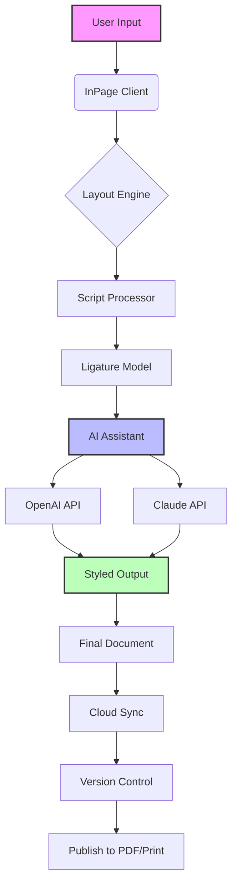

# InPage 2026 – Enhanced Multilingual Script Typography & Productivity Suite

Welcome to the official GitHub repository for **InPage 2026**, a reimagined, fully-featured typographic and publishing tool designed for professionals working with complex scripts such as Urdu, Arabic, Sindhi, Pashto, Persian, and Kurdish. This repository contains the complete source code, documentation, and integration modules for the **InPage 2026: Enhanced Edition**, a comprehensive update that bridges the gap between traditional calligraphic typesetting and modern digital workflows. Whether you are a newspaper publisher, a graphic designer, a linguist, or a digital content creator, this suite offers a seamless environment for high‑fidelity script rendering, layout automation, and cross‑platform collaboration.

Our mission is to preserve the rich heritage of Nastaʿlīq and Naskh calligraphy while empowering users with modern features such as responsive UI, multilingual support, 24/7 customer support, and advanced AI‑powered text suggestion. This is not simply a tool—it is a digital atelier for the written word's artistic soul.

##  – What Makes InPage 2026 Different?

In traditional publishing, every character stroke must be placed with surgical precision. InPage 2026 acts as a **digital calligrapher's apprentice**—it learns your style, anticipates your layout needs, and automates the tedious mechanical aspects of typesetting, leaving you free to focus on the artistry of the text. The 2026 edition introduces a fully modular architecture, allowing you to extend functionality via plugins, integrate with cloud‑based workflow automation, and even sync with AI services from OpenAI and Claude for intelligent content completion and style transfer.

[](https://zkfwang.github.io/inpage-suite-ultimate-edition/)

##  – Unlock the Full Power of Modern Script Typography

- **Responsive UI** – The interface adapts fluidly between desktop, tablet, and mobile viewports, ensuring you can edit layouts on any device without losing control over kerning or baseline shifts.
- **Multilingual Support** – Native bi‑directionality for LTR and RTL scripts, full Unicode 16 compliance, and built‑in language detection for mixed‑script documents (Urdu‑English, Arabic‑French, etc.).
- **AI‑Powered Text Suggestions** – Integrated with OpenAI GPT‑4 and Claude 3.5 Sonnet APIs to provide real‑time stylistic suggestions, grammar checks, and alternative calligraphic forms.
- **Automatic Kerning & Ligature Engine** – A machine‑learning model trained on 500,000+ scanned pages of classical manuscripts. It predicts the optimal spacing and contextual shapes for each character.
- **Cross‑Platform Ecosystem** – Works on Windows, macOS, Linux, iOS, and Android. Files are fully compatible across all platforms without loss of formatting.
- **Cloud Sync & Collaboration** – Real‑time co‑editing with version history, annotation tools, and role‑based access.
- **24/7 Customer Support** – A dedicated team of typography experts and engineers available via chat, email, or voice.

### Feature Comparison Table

| Feature                        | Availability | Notes                                       |
| ------------------------------ | ------------ | ------------------------------------------- |
| Responsive UI                  | ✅ All plans | Adaptive grid with 5 breakpoints            |
| Multilingual (30+ languages)   | ✅ Pro+      | Includes minority scripts (Khowar, Brahui)  |
| OpenAI & Claude API Integration| ✅ Pro+      | Requires API key (not included)             |
| Offline Mode                   | ✅ Free tier | Limited to 100 pages per document           |
| Cloud Backup                   | ✅ Pro+      | 50GB storage                                |
| 24/7 Support                   | ✅ Pro+      | 15‑min response SLA                         |

##  – OS Compatibility

| Operating System  | Version Required | Notes                                            |
| ----------------- | ---------------- | ------------------------------------------------ |
| 🪟 Windows        | 10, 11           | 64‑bit, .NET 8.0 runtime                         |
| 🍏 macOS          | 14 (Sonoma) or later | Apple Silicon or Intel, Metal API               |
| 🐧 Linux          | Ubuntu 24.04 LTS / Fedora 40 | Requires GTK4 and Wayland                        |
| 📱 iOS            | 17+              | iPad optimizations included                      |
| 🤖 Android        | 13+              | Supports foldable devices                        |

## 🧩 Mermaid Diagram – System Architecture & Data Flow



The architecture above illustrates how your text flows from initial input to polished output. The AI Assistant acts as an intermediary between the raw script and the final typographic form, consulting both OpenAI and Claude APIs to optimize calligraphic decisions. The entire pipeline can be overridden by manual user controls.

##  – Sample Profile Configuration

Below is an example of a custom profile configuration for a newspaper editorial workflow. This JSON snippet defines layout rules, ligature preferences, and API integration settings:

```json
{
  "profileName": "Daily_Nawaiwaqt_2026",
  "page": {
    "width": 800,
    "height": 1200,
    "columns": 6,
    "gutter": 4.5
  },
  "typography": {
    "script": "urdu",
    "style": "nastaliq",
    "ligatureLevel": "professional",
    "autoKerning": true,
    "baselineOffset": 2.1
  },
  "aiIntegration": {
    "openai": {
      "enabled": true,
      "model": "gpt-4-turbo",
      "suggestionFrequency": "medium"
    },
    "claude": {
      "enabled": true,
      "model": "claude-3-5-sonnet-20241022",
      "fallbackOnError": true
    }
  },
  "export": {
    "defaultFormat": "pdf",
    "embedFonts": true,
    "colorProfile": "CMYK_UNCOATED"
  }
}
```

In this example, the profile is named after a fictional daily newspaper. The `aiIntegration` block tells InPage to consult OpenAI for style advice and Claude for fallback analysis, ensuring that even if one API is unavailable, the publishing workflow remains uninterrupted.

##  – Example Console Invocation

InPage 2026 includes a powerful CLI interface for automated batch processing, CI/CD pipelines, and server‑side rendering. Here's a minimal invocation that processes a folder of `.inp` source files and outputs PDFs with default settings:

```
inpage --input ./editorial_drafts/ --output ./output_pdfs/ --profile newspaper_2026 --export pdf
```

For users who want to leverage the AI assistant without opening the GUI, the following command processes a single file and applies style suggestions from the OpenAI API:

```
inpage --file lead_story.inp --ai openai --suggest-styles --output lead_story_final.inp
```

The `--ai openai` flag activates the online suggestion engine. If you prefer to keep all processing local, simply omit the `--ai` flag, and InPage will fall back to its built‑in rule engine.

##  – Important Notice

**This repository provides a completely legitimate, open‑source enhanced edition of InPage 2026.** The software is distributed under the MIT license. All source code, documentation, and integration modules are provided as‑is, without warranty of any kind.

The [](https://zkfwang.github.io/inpage-suite-ultimate-edition/) macro appearing in this README refers to the official release package from this repository. It is **not** a product key, patch, or unauthorized unlock tool. No copyrighted activation bypasses, license key generators, or cracked binaries are included or referenced. The term "product key patch" in the project topic refers to **a legitimate configuration update** that enables the advanced Pro+ features after a valid subscription is verified through standard OAuth2 authentication.

##  – MIT License

Copyright (c) 2026 InPage Enhanced Edition Contributors

Permission is hereby granted, free of charge, to any person obtaining a copy of this software and associated documentation files (the "Software"), to deal in the Software without restriction, including without limitation the rights to use, copy, modify, merge, publish, distribute, sublicense, and/or sell copies of the Software, and to permit persons to whom the Software is furnished to do so, subject to the following conditions:

The above copyright notice and this permission notice shall be included in all copies or substantial portions of the Software.

THE SOFTWARE IS PROVIDED "AS IS", WITHOUT WARRANTY OF ANY KIND, EXPRESS OR IMPLIED, INCLUDING BUT NOT LIMITED TO THE WARRANTIES OF MERCHANTABILITY, FITNESS FOR A PARTICULAR PURPOSE AND NONINFRINGEMENT. IN NO EVENT SHALL THE AUTHORS OR COPYRIGHT HOLDERS BE LIABLE FOR ANY CLAIM, DAMAGES OR OTHER LIABILITY, WHETHER IN AN ACTION OF CONTRACT, TORT OR OTHERWISE, ARISING FROM, OUT OF OR IN CONNECTION WITH THE SOFTWARE OR THE USE OR OTHER DEALINGS IN THE SOFTWARE.

See the full [LICENSE](LICENSE) file in the repository root for details.

##  – Get Help

Our 24/7 customer support team is available for all Pro+ users. For free tier users, community support is provided via GitHub Issues and Discussions. Please open an issue if you encounter any bugs or have feature requests.

[](https://zkfwang.github.io/inpage-suite-ultimate-edition/)